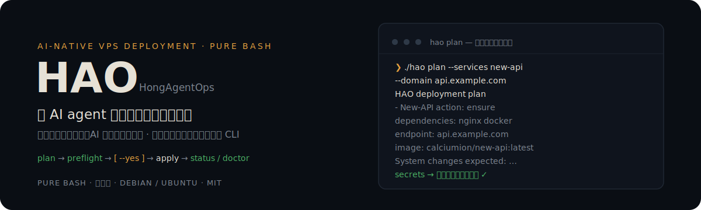
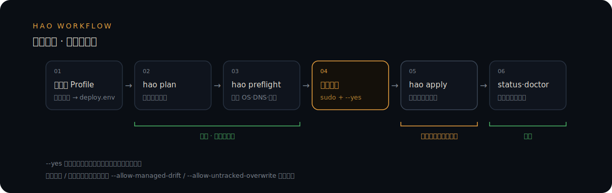
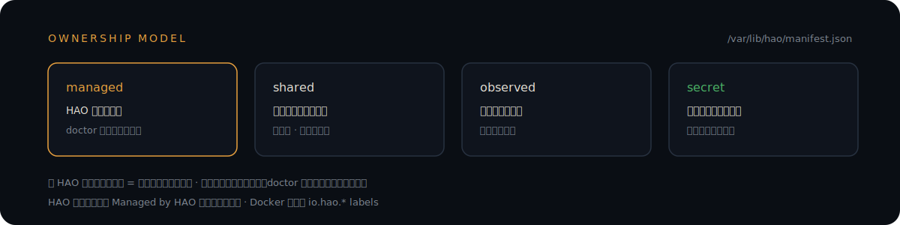

<p align="center">
  
</p>

<p align="center">
  <a href="https://github.com/YoungHong1992/HAO/actions/workflows/ci.yml"></a>
  <a href="https://github.com/YoungHong1992/HAO/releases"></a>
  <a href="LICENSE"></a>
</p>

HongAgentOps 是洪哥出品的 AI 原生服务器部署工具。它把传统终端菜单改造成适合 AI agents 调用的确定性 CLI：**人在对话里确认目标和风险，AI 生成部署 profile、检查环境、执行明确的参数化命令**。纯 Bash 实现，零运行时依赖，面向 Debian/Ubuntu VPS。

> 🤖 **如果你是 AI agent**：先读 [AGENTS.md](AGENTS.md)——工作流契约、知识库索引、skill 安装方式都在那里。

## 眼见为实

`plan` 是只读的。下面是它在一台真实机器上的原样输出——先告诉你会发生什么，不碰系统一根手指：

```text
$ ./hao plan --services new-api --domain api.example.com

HAO deployment plan
Release: dev-d1f9124

Install order:
  - New-API
    dependencies: nginx docker
    access_mode: domain
    endpoint: api.example.com
    action: ensure
    database: postgresql
    image: calciumion/new-api:latest
    image_candidates:
      - calciumion/new-api:latest (rolling default)
      - calciumion/new-api:v1.0.0-rc.21 (release-candidate)
    candidates_checked: 2026-07-13

System changes expected:
  - May install OS packages and enable systemd services
  - May write files under /opt, /etc/nginx, /etc/docker, /var/log/vps-deploy, /var/lib/hao
  - Records HAO ownership and resource hashes in /var/lib/hao/manifest.json
  - Nginx configs are backed up before overwrite where supported
  - Secret values are written to credential files and are not printed
```

这套流程由可查证的机制守护：

- **测试门禁**：`tests/` 下 15 个测试脚本——`bash -n` 语法检查、全仓 shellcheck、单元与 CLI 冒烟测试，每次提交由 [CI workflow](.github/workflows/ci.yml) 执行
- **真实安装验证**：[Integration workflow](.github/workflows/integration.yml) 在真实 runner 上做双次 `apply` 幂等测试（maintenance / New-API 双数据库 / uv / 所有权安全）
- **发布验收**：每次发布前在验收矩阵内的全部 Ubuntu LTS 真机上完成验收，证据 URL 写入归档内 `build-info.json`（见[发布流程](docs/releasing.md)）
- **镜像候选审查**：Docker 固定标签候选记录于 [`config/image-candidates.tsv`](config/image-candidates.tsv)，含 UTC 审查日期，发布工作流拒绝过期记录

## 为什么不一样

传统部署脚本靠交互菜单，AI 用不了；直接让 AI 跑任意 shell，你不放心。HAO 把两件事分开：

- **只读命令随便跑**：`plan` / `preflight` / `status` / `doctor` / `inventory` 不修改任何东西
- **修改系统只有一条路**：root + 显式 `--yes`（或 `HAO_CONFIRM_APPLY=yes`），且只做计划里列出的事
- **每个改动可审计**：归属和文件哈希写入管理清单，事后随时用 `inventory` / `doctor` 核对

## 快速开始

```bash
git clone https://github.com/YoungHong1992/hao.git
cd hao

cat > deploy.env <<'EOF'
HAO_SERVICES="maintenance,nginx,docker,new-api"
HAO_ACCESS_MODE="domain"
HAO_NEWAPI_DOMAIN="api.example.com"
HAO_DB_TYPE="postgresql"
EOF

./hao plan --profile deploy.env        # 只读：输出变更计划
./hao preflight --profile deploy.env   # 只读：检查 OS、权限、DNS、端口
sudo ./hao apply --profile deploy.env --yes   # 确认后才执行
./hao status                           # 只读：查看部署结果
```

> 建议由 AI agent 先和你确认服务、域名、数据库、风险项，再生成 `deploy.env`。

## 部署工作流

<p align="center">
  
</p>

`--yes` 只确认部署计划，不授权覆盖所有权冲突。受管资源发生漂移时还需要单独的 `--allow-managed-drift`；目标路径已有未跟踪文件时需要单独的 `--allow-untracked-overwrite`。两项确认互不替代，使用前应先审查 plan/preflight 列出的具体路径。

> 同时部署多个 Web 服务时，请为每个服务准备独立域名，避免争用同一个 Nginx `server_name` 和 `/` 路由。

## 组件

| 组件 | 描述 | 资源需求 |
|------|------|----------|
| **Maintenance** | fail2ban、swap、journald 限制、Docker 日志轮转 | 基础维护 |
| **Nginx** | HTTP/3 (QUIC) + BBR 优化，所有 Web 服务的统一入口 | 512MB 内存 |
| **Docker** | Docker Engine + Compose 插件 | 无额外需求 |
| **Git + GitHub** | Git 身份 + 官方 `gh` + Web/SSH 授权准备；不包含在 `all` | 开发机 / 管理型 VPS |
| **CliproxyAPI** | 轻量 AI API 转发代理，默认 Docker Compose，可选裸机 | 256MB 内存 |
| **New-API** | AI 模型网关与资产管理系统，Docker Compose | ≥ 1GB 内存 |
| **Claude Code** | Anthropic 官方终端 AI 编程助手，可选自定义网关/模型 | 500MB 磁盘 |
| **uv** | uv Python 包/环境管理器 + AI 助手虚拟环境使用约定 | 50MB 磁盘 |

CliproxyAPI / New-API 依赖 Nginx（Docker Compose 部署还依赖 Docker），缺少依赖时脚本会提示先安装。CPA 裸机模式：`HAO_CLIPROXY_MODE=bare`。

<details>
<summary><b>用一句话理解 Nginx</b>（面向非技术用户）</summary>

可以把 **Nginx 理解成服务器入口处的"接线员兼门卫"**：外部请求先到 Nginx，Nginx 看清请求要找谁，再把它转接给 New-API、CliproxyAPI 等内部服务；同时还负责 HTTPS 证书、标准的 80/443 端口、WebSocket、访问日志和基础访问控制。

```text
api.example.com ──┐
                  ├──> Nginx（接线员）──> 对应的内部服务
cpa.example.com ──┘
```

域名就像分机号。同一个公网 IP 上部署多个服务时，Nginx 根据域名把请求转到不同服务；完全不用域名时也可以用 `IP:不同端口` 区分，但多个服务不能同时占用相同的 80/443 端口。技术上单个内网服务可以不经过 Nginx 直接用 `IP:端口` 访问；当前 HAO 的 New-API 和 CliproxyAPI 部署仍将 Nginx 作为统一入口。生产环境建议保留 Nginx；只有在内网、VPN 等受控环境中直接开放服务端口才通常更合适。

</details>

<details>
<summary><b>Git、gh、SSH Key 分别做什么</b>（git-github 组件的边界）</summary>

三层分工：Git 的 `user.name` / `user.email` 决定提交上写谁；SSH Key 负责安全地拉取和推送仓库；`gh` 负责创建 PR、Release 等平台操作。HAO 默认采用 `gh auth login --web --git-protocol ssh`，不要求手工创建长期 Token。

- `git-github` 是个人身份工具，必须显式选择，不随 `--services all` 安装
- AI 必须先询问用户准确的姓名、邮箱、目标系统用户、机器角色和配置范围，不能自动推导
- 安装只准备工具和 Git 身份；浏览器/设备码授权由目标用户随后运行 `hao-github-authorize` 完成
- 生产 VPS 只拉公开仓库选 `skip`；私有仓库自动部署优先用只读 Deploy Key 或 GitHub App
- root-only VPS 可明确选择 `root`，HAO 会警告凭据和 SSH Key 归 root 所有，但不阻止授权

</details>

## 资源归属与审计

通过 HAO 成功部署后，根执行器会在 `/var/lib/hao/` 写入不含秘密的管理清单：

<p align="center">
  
</p>

```bash
./hao inventory    # 机器可读的 JSON 管理清单
./hao status       # 服务安装情况与 managed/observed/untracked 状态
./hao doctor       # 检查服务状态、环境和受管文件是否被修改或删除
```

含运行时秘密的生成配置仅 root 可读；manifest 不保存文件内容，普通受管文件只记录 SHA-256 用于发现漂移。较早的 HAO 部署没有统一 manifest，升级后显示为 `untracked`，直到通过新版 HAO 完成一次受控重部署——HAO 不会仅凭文件路径自动认领旧资源。

## 其他安装方式

<details>
<summary><b>下载发布包安装</b>（推荐生产环境固定发布标识）</summary>

```bash
curl -fsSLO https://github.com/YoungHong1992/hao/releases/latest/download/hao.tar.gz
tar xzf hao.tar.gz
cd hao
./hao plan --services new-api --domain api.example.com
```

生产环境固定发布标识并校验：

```bash
HAO_RELEASE="260713-abcdef0" # 替换为实际发布标识
curl -fsSLo hao.tar.gz "https://github.com/YoungHong1992/hao/releases/download/${HAO_RELEASE}/hao.tar.gz"
curl -fsSLo checksums.txt "https://github.com/YoungHong1992/hao/releases/download/${HAO_RELEASE}/checksums.txt"
sha256sum -c checksums.txt
```

发布标识形如 `YYMMDD-<git-short-hash>`，只标识一次不可变构建，不表达兼容级别。归档内的 `RELEASE` 和 `build-info.json` 记录发布标识、完整提交哈希、UTC 构建时间和真机验收记录。

</details>

<details>
<summary><b>远程自举入口</b></summary>

```bash
curl -fsSL https://raw.githubusercontent.com/YoungHong1992/hao/main/install.sh | bash
```

无参数运行只显示帮助，不进入终端菜单。根入口只作为确定性 CLI 执行器和远程自举入口；请使用 release 包或完整仓库中的 `hao plan/preflight/apply/status/doctor`。

</details>

<details>
<summary><b>单独安装某个组件</b></summary>

每个组件目录都有统一命名的 `install.sh`，供 `hao apply` 非交互调用，也可单独运行（推荐保留完整仓库结构，部分组件依赖 `lib/` 公共库）：

```bash
cd maintenance && sudo ./install.sh        # 服务器维护基线
cd ../nginx && sudo ./install.sh           # Nginx
cd ../docker && sudo ./install.sh          # Docker
cd ../cliproxyapi && sudo ./install.sh     # CliproxyAPI（默认 Docker Compose）
cd ../new-api && sudo ./install.sh         # New-API
cd ../claude-code && sudo ./install.sh     # Claude Code
cd ../uv && sudo ./install.sh              # uv + Python 环境约定
```

`git-github` 需要逐项确认身份信息：

```bash
cd git-github && sudo \
  HAO_GIT_NAME="用户确认的姓名" \
  HAO_GIT_EMAIL="用户确认的邮箱" \
  HAO_GIT_MACHINE_ROLE=workstation \
  HAO_GIT_SCOPE=global \
  HAO_GIT_TARGET_USER="$USER" \
  ./install.sh
```

</details>

## 配置参考

Profile 支持的常用变量（也可用等价 CLI 参数）：

```bash
HAO_SERVICES="maintenance,nginx,docker,cliproxyapi,new-api,claude-code,uv"
HAO_ACCESS_MODE="domain"       # domain | ip | http
HAO_CLIPROXY_DOMAIN="cpa.example.com"
HAO_NEWAPI_DOMAIN="api.example.com"
HAO_CLIPROXY_MODE="docker"     # docker | bare
HAO_DB_TYPE="postgresql"       # postgresql | mysql
HAO_NEWAPI_ACTION="ensure"     # ensure | upgrade | migrate-db
HAO_CONFIRM_APPLY="yes"        # 等价于 apply --yes
```

要点：

- 已有 New-API 在 `ensure` 下默认 no-op；显式 `upgrade` 才刷新镜像和配置，且必须复用现有数据库、Redis 与 Session 密钥
- 数据库引擎切换必须走独立、可回滚的数据迁移流程；HAO 不把创建空库当作迁移
- Docker 镜像默认跟随 `latest`，`hao plan` 会同时显示最近审查确认的两个固定标签（来源 `config/image-candidates.tsv`）；New-API 当前上游候选仍属 RC，计划输出会明确标记 `release-candidate`
- `git-github` 使用单独 profile（`HAO_GIT_*` / `HAO_GH_AUTH_MODE`），字段全部要求用户逐项确认

完整变量与服务别名见 [`skills/hao-deploy/references/services.md`](skills/hao-deploy/references/services.md)。

### AI Agent Skill

仓库内置 `skills/hao-deploy`，让各类 AI agent 按 HAO 的安全流程部署服务，不绕过任何确认机制：

```bash
./skills/hao-deploy/scripts/install-skill.sh                       # Claude Code (~/.claude/skills)
./skills/hao-deploy/scripts/install-skill.sh --dir /path/to/skills # 其他 agent 运行时
```

## 支持的操作系统

正式支持矩阵遵循 Debian stable/oldstable 与 Ubuntu 标准维护期内的主流 LTS，`preflight` 会拒绝矩阵外的版本：

| 发行版 | 支持版本 |
|---|---|
| Debian | 13、12 |
| Ubuntu LTS | 26.04、24.04、22.04 |

> **发布验收仅覆盖 Ubuntu。** Debian 仍是受支持的安装目标，但发布前的真机验收与 CI 集成测试只在 Ubuntu 上执行（GitHub 托管 runner 没有 Debian 镜像，容器无法真实验证 systemd/Docker/UFW）。贡献者请勿添加或运行 Debian 验收测试，详见 [docs/releasing.md](docs/releasing.md)。

## 安全设计

- 所有密码和密钥使用加密安全随机数生成；秘密只写入凭据文件，日志与输出仅记录路径
- SSL/TLS 最低 TLSv1.2；支持域名（Let's Encrypt）和 IP（自签名）两种证书模式
- fail2ban 默认防 SSH 暴力破解；swap 按内存自动配置降低 OOM 风险
- journald / Docker 日志轮转限制磁盘占用；安装日志记录到 `/var/log/vps-deploy/`
- Nginx 配置先备份再覆盖

## 开发

```bash
apt-get install -y shellcheck
./tests/run.sh                              # 静态检查 + 仓库测试
sudo ./tests/test-maintenance-idempotency.sh # 真实安装幂等测试，只在 CI/临时机执行
```

- 新增组件遵循 [docs/adding-a-module.md](docs/adding-a-module.md)
- 发布流程与真机验收矩阵见 [docs/releasing.md](docs/releasing.md)；GitHub Release 由 `Release` workflow 手工触发，标识自动生成，已有发布不会被覆盖
- 辅助文档：[Cloudflare DNS 配置指南](docs/cloudflare-dns-guide.md) · [Claude Code 安装和配置指南](docs/claude-code-guide.md) · [Git + GitHub 工具说明](git-github/README.md)

---

<p align="center">
  <sub>发布标识 <code>YYMMDD-&lt;git-short-hash&gt;</code> · MIT License · 更新日期 2026-07-16</sub>
</p>
